# Mermaid Syntax Reference

Comprehensive reference for Mermaid diagram syntax. Use this when writing `.mmd` files.

---

## Flowchart

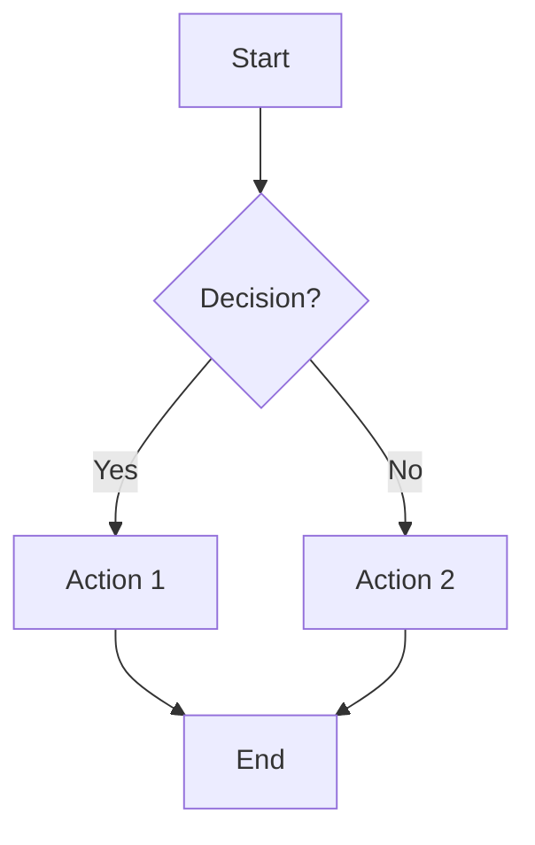

### Direction
- `TD` or `TB` — Top to bottom
- `BT` — Bottom to top
- `LR` — Left to right
- `RL` — Right to left

### Node Shapes
```
A["Rectangle"]
B("Rounded rectangle")
C(["Stadium / pill"])
D[["Subroutine"]]
E[("Cylinder / database")]
F(("Circle"))
G{"Diamond / decision"}
H{{"Hexagon"}}
I>"Asymmetric / flag"]
J[/"Parallelogram"/]
K[\"Reverse parallelogram"\]
L[/"Trapezoid"\]
M[\"Reverse trapezoid"/]
N@{ shape: braces, label: "Curly braces" }
```

### Links / Edges
```
A --> B           solid arrow
A --- B           solid line (no arrow)
A -.-> B          dotted arrow
A -.- B           dotted line
A ==> B           thick arrow
A === B           thick line
A -->|"label"| B  labeled arrow
A -- "label" --> B  alternative label syntax
A <--> B          bidirectional
A ~~~ B           invisible link (for layout)
```

### Subgraphs
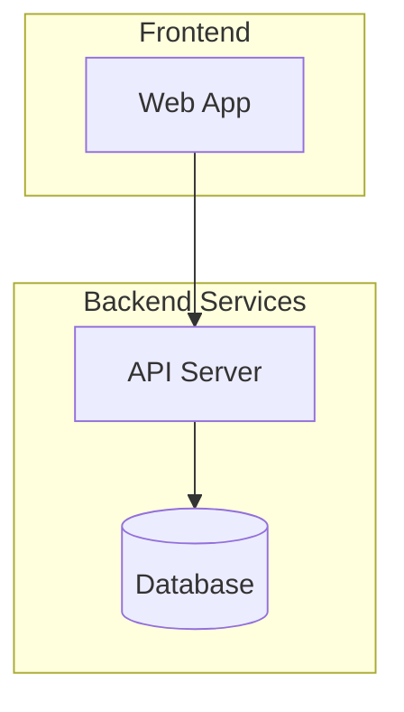

### Styling
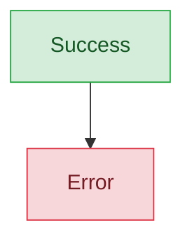

### Style individual links
```
linkStyle 0 stroke:red,stroke-width:2px
linkStyle default stroke:#333,stroke-width:1px
```

---

## Sequence Diagram

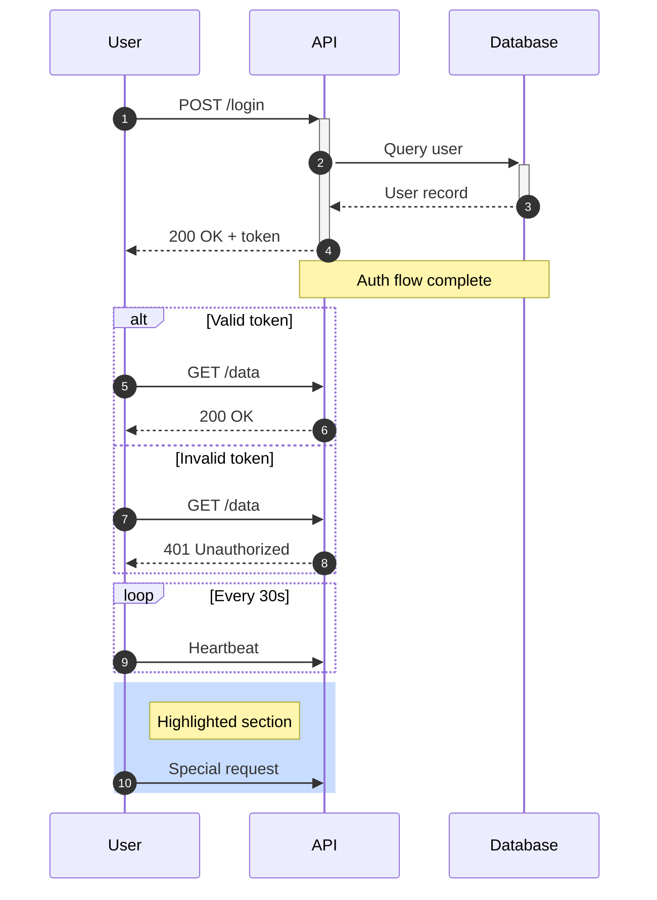

### Arrow Types
```
->>    solid arrow (request)
-->>   dashed arrow (response)
-)     async message (open arrow)
--)    async dashed
->>+   activate target
-->>-  deactivate target
-x     solid cross (lost message)
--x    dashed cross
```

### Features
- `autonumber` — auto-number messages
- `participant X as "Label"` — alias participants
- `actor X as "Label"` — stick figure instead of box
- `Note over A,B: text` — spanning note
- `Note right of A: text` — positioned note
- `alt / else / end` — conditional
- `opt / end` — optional
- `loop / end` — loop
- `par / and / end` — parallel
- `critical / option / end` — critical section
- `break / end` — break out
- `rect rgb(r,g,b) / end` — highlight region
- `create participant X` — dynamic creation
- `destroy X` — dynamic destruction

---

## Class Diagram

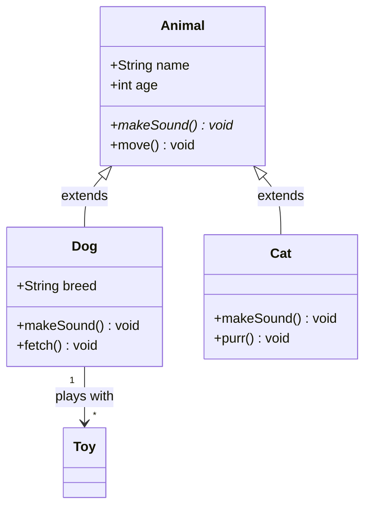

### Visibility
```
+ public
- private
# protected
~ package/internal
```

### Relationships
```
A <|-- B    Inheritance
A *-- B     Composition
A o-- B     Aggregation
A --> B     Association
A ..> B     Dependency
A ..|> B    Realization/Implementation
A -- B      Link (solid)
A .. B      Link (dashed)
```

### Cardinality
```
"1" -- "1"       one to one
"1" -- "*"       one to many
"1" -- "0..1"    one to zero or one
"*" -- "*"       many to many
```

### Annotations
```
<<interface>> ClassName
<<abstract>> ClassName
<<service>> ClassName
<<enumeration>> ClassName
```

---

## State Diagram

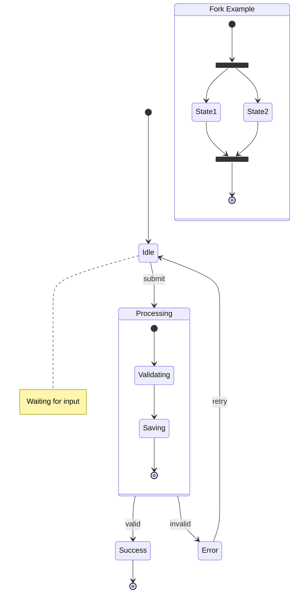

### Features
- `[*]` — start/end pseudo-state
- `state "Label" as id` — aliased state
- Nested states with `state Parent { ... }`
- `<<fork>>`, `<<join>>` — concurrent states
- `<<choice>>` — choice pseudo-state
- `note right of State : text` — notes

---

## Entity-Relationship Diagram

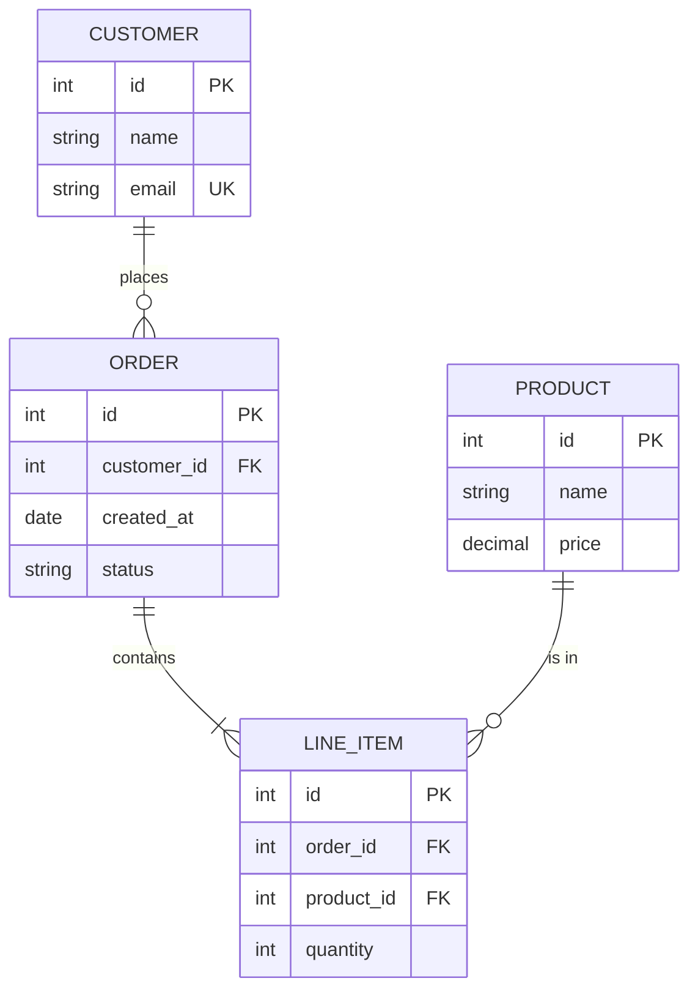

### Relationship Syntax
```
||--||    exactly one to exactly one
||--o{    one to zero or more
||--|{    one to one or more
o{--o{    zero or more to zero or more
```

### Cardinality symbols
```
||    exactly one
o|    zero or one
}|    one or more
}o    zero or more
```

### Attribute markers
- `PK` — primary key
- `FK` — foreign key
- `UK` — unique key

---

## Gantt Chart

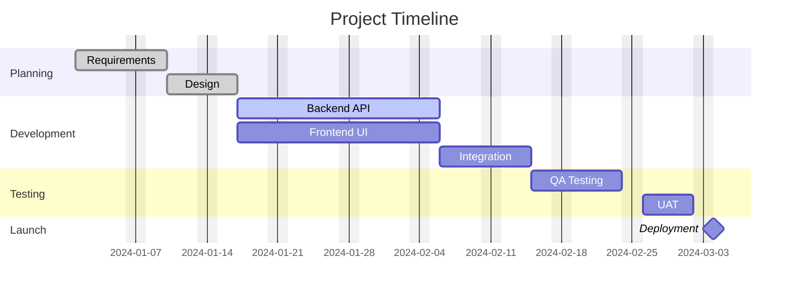

### Task status
- `done` — completed
- `active` — in progress
- `crit` — critical path
- No status — future/pending
- `milestone` — milestone marker (0d duration)

---

## Pie Chart

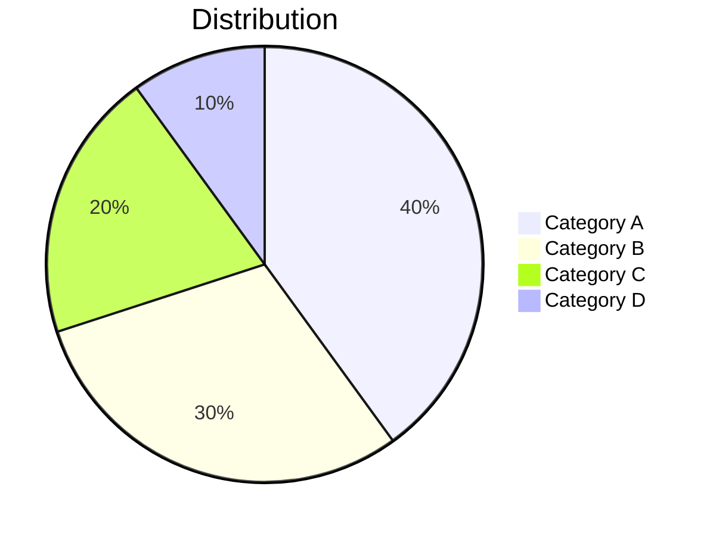

---

## Mindmap

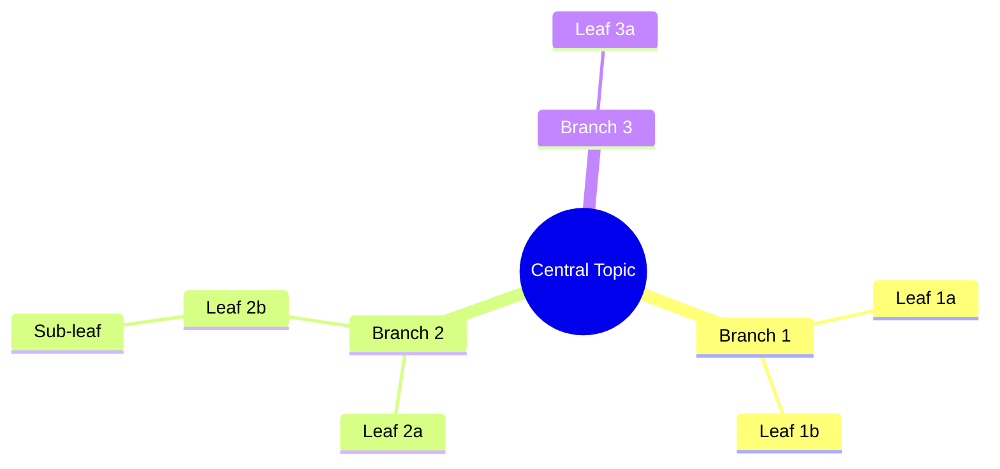

### Node shapes in mindmap
```
root((Circle))
    Default rectangle
    (Rounded)
    [Square]
    ))Bang((
    )Cloud(
    {{Hexagon}}
```

---

## Timeline

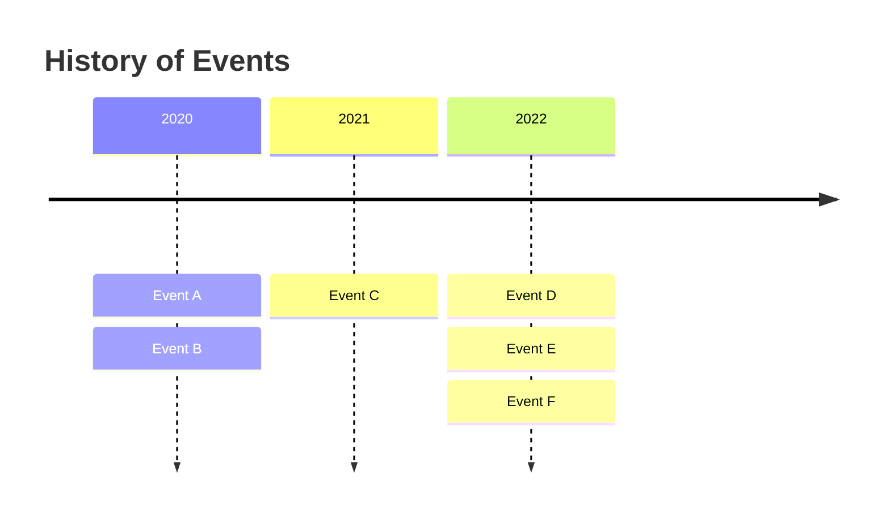

---

## Git Graph

```mermaid
gitgraph
    commit id: "Initial"
    branch develop
    checkout develop
    commit id: "Feature start"
    commit id: "Feature done"
    checkout main
    merge develop id: "Release v1"
    commit id: "Hotfix"
```

---

## User Journey

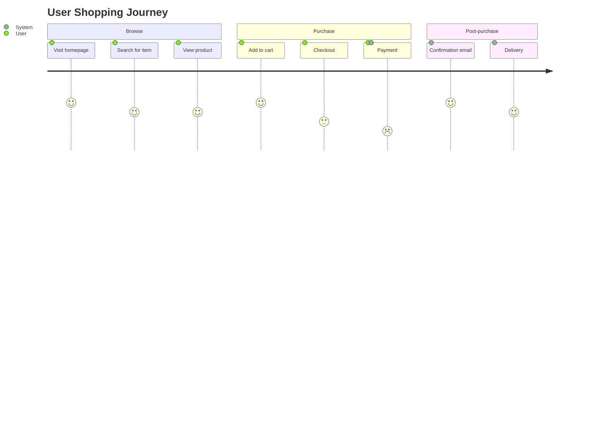

Scores are 1-5 (1 = negative, 5 = positive).

---

## Quadrant Chart

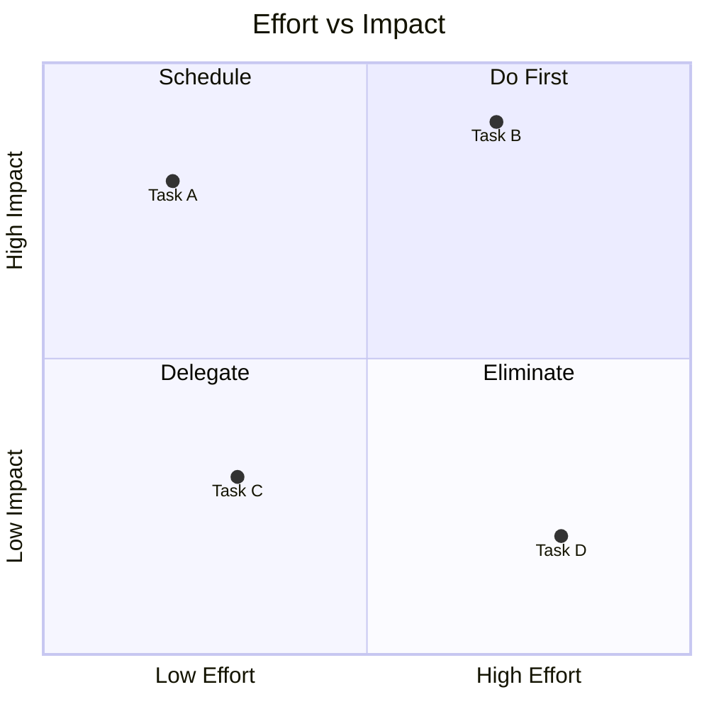

---

## Common Patterns & Tips

### Escaping special characters
- Wrap labels in double quotes when they contain special chars: `A["Node with (parens)"]`
- Use `#quot;` for quotes inside labels
- Use `#amp;` for ampersands
- Use `#lt;` and `#gt;` for angle brackets

### Layout control
- Use invisible links `A ~~~ B` to influence layout without visible connections
- Increase `width` and `height` in `mmdc` for complex diagrams
- Use `direction` inside subgraphs to mix LR and TD layouts
- Keep node IDs short (single letters or short abbreviations)

### Color palettes for classDef
```
Success:  fill:#d4edda,stroke:#28a745,color:#155724
Warning:  fill:#fff3cd,stroke:#ffc107,color:#856404
Error:    fill:#f8d7da,stroke:#dc3545,color:#721c24
Info:     fill:#cce5ff,stroke:#004085,color:#004085
Primary:  fill:#b8daff,stroke:#0056b3,color:#0056b3
Neutral:  fill:#e2e3e5,stroke:#6c757d,color:#383d41
Purple:   fill:#e8d5f5,stroke:#6f42c1,color:#4a0e78
```

### mmdc CLI usage
```bash
# Basic PNG generation
mmdc -i input.mmd -o output.png -q

# High-res with theme
mmdc -i input.mmd -o output.png -t forest -w 1200 -H 800 -s 2 -b white -q

# SVG output
mmdc -i input.mmd -o output.svg -t neutral -q

# PDF output
mmdc -i input.mmd -o output.pdf -f -q

# Dark theme with transparent background
mmdc -i input.mmd -o output.png -t dark -b transparent -s 2 -q
```

### Themes
- `default` — clean, professional, blue-toned
- `forest` — green-toned, nature palette
- `dark` — dark background, light text
- `neutral` — grayscale, minimal color
